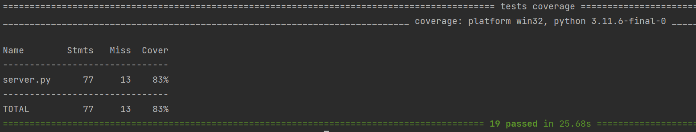
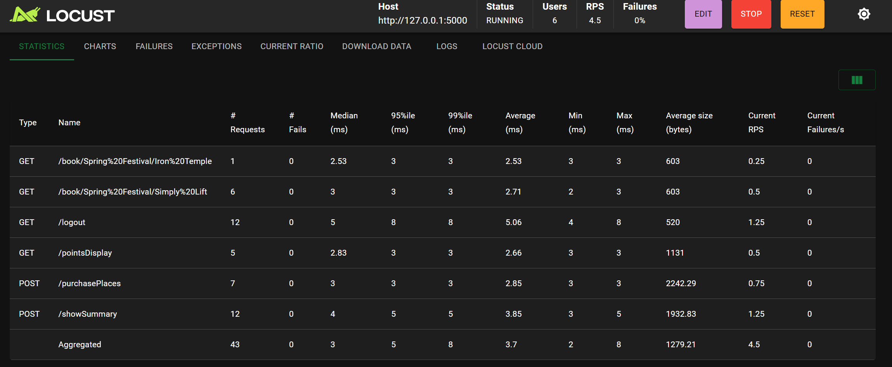
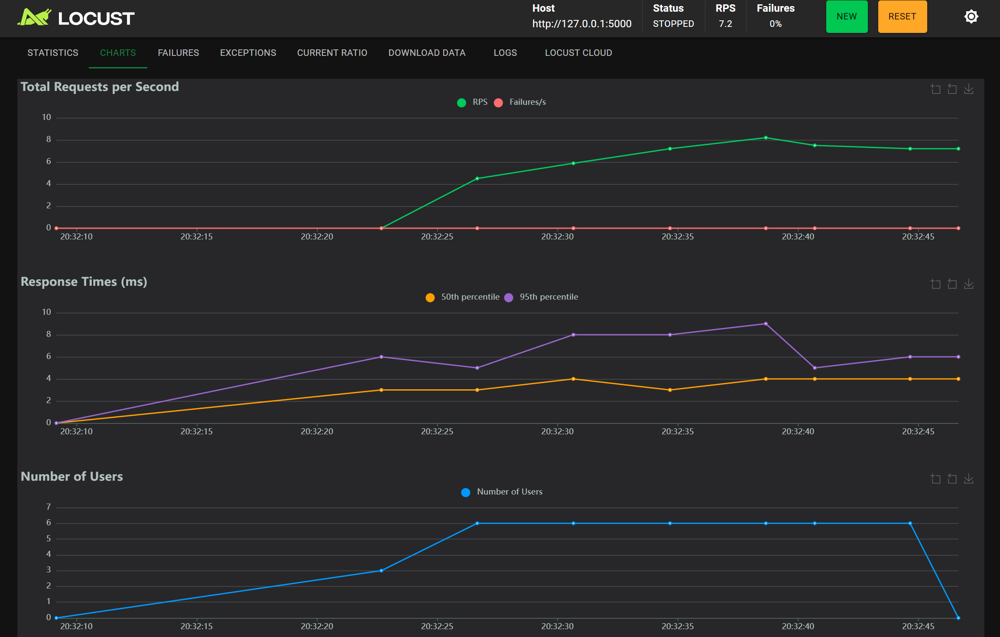
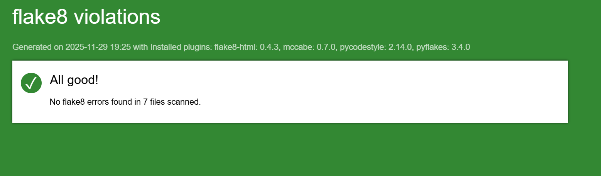

# gudlift-registration

## 1. Presentation
This is digital platform to coordinate strength competitions and their participants.
This project is a proof of concept (POC) project to show a light-weight version of our competition booking platform. The aim is the keep things as light as possible, and use feedback from the users to iterate.


## 2. Getting Started

This project uses the following technologies:
* Python v3.x+
* [Flask](https://flask.palletsprojects.com/en/1.1.x/)
    > Whereas Django does a lot of things for us out of the box, Flask allows us to add only what we need. This keeps the project light-weight and easy to understand.
* [Virtual environment](https://virtualenv.pypa.io/en/stable/installation.html)
    > This ensures you'll be able to install the correct packages without interfering with Python on your machine.

    >Before you begin, please ensure you have this installed globally. 


## 3. Setup & Installation

This project requires Python 3.10+ and uses a virtual environment.

To install and run the application locally:

1. Clone this repository:
   ``` bash
   git clone https://github.com/your-username/Python_Testing.git
   ```

2. Create and activate a virtual environment: (windows)
    ``` bash
    python -m venv .env
    cd .\.env\Script
    .\activate
    ```

3. Install all dependencies:
    ``` bash
    pip install -r requirements.txt
    ```

4. Set the environment variable (required for Flask to find the entry point):
    ``` bash
    export FLASK_APP=server.py
    ```

5. Run the application:
    ``` bash
    flask run
    ```

You should see the app running on http://127.0.0.1:5000/


## 4. Current Setup

The app is powered by [JSON files](https://www.tutorialspoint.com/json/json_quick_guide.htm). This is to get around having a DB until we actually need one.

The main ones are:

* competitions.json - list of competitions
* clubs.json - list of clubs with relevant information. You can look here to see what email addresses the app will accept for login.

The project structure is as follows:

``` bash
├── .coveragerc  # Coverage configuration file
├── .DS_Store
├── .coverage
├── .flake8
├── .gitignore
├── README.md
├── clubs.json
├── competitions.json
├── locustfile.py
├── requirements.txt
├── server.py
├── templates  # HTML templates folder
│   ├── booking.html
│   ├── index.html
│   ├── index.html
│   └── points_board.html
│   └── welcome.html
├── tests  # Tests folder
│   ├── __init__.py
│   ├── fonctionnel  # Functional tests folder
│   │   ├── test_functional.py
│   ├── integration  # integration tests folder
│   │   ├── test_email_int.py
│   │   └── test_purchase_places_integration.py
│   ├── unitaire  # unitaire tests folder
│       ├── test_email_unit.py
│       └── test_purchase_places_unit.py

```


## 5. Testing

To do test driven development (TDD), we use:
* [pytest](https://docs.pytest.org/en/6.2.x/) 


To run the tests, we use pytest fixtures to set http client. This ensures that each test runs in isolation and does not affect other tests.

To launch the tests :
``` bash

pytest tests/
```

The coverage report is generated using the `--cov` option. To generate a coverage report, run:
``` bash
 pytest --cov=server  
 ``` 

### Tests Coverage



## 6. Performance Testing - Locust

To do performance testing, we use:
* [Locust](https://locust.io/) - to simulate user traffic and measure performance

To launch locust, run:
``` bash
locust -f locustfile.py --host=http://127.0.0.1:5000

```
Then open a web browser and go to `http://127.0.0.1:8089`

* You need to specify the number of users to simulate and the spawn rate. For example, to simulate 6 users enter `6` in the "Number of users to simulate" field.
* You need to specify the Host URL of the application running.
* Then click the "Start" button.

### This is the result of performance testing with 6 users.



### This is the chart of the result of performance testing.



## 7. Quality 

### Flake8 
To ensure code quality and style, we use:

* [Flake8](https://flake8.pycqa.org/en/latest/) - to ensure code style and quality 
``` bash
flake8 .
```
### Flake8 report




### Branch Naming Convention

>  Note: The default branch for this project is named `master`, following the original repository structure.

We use the following branch naming convention:
* `feature/branch-name` - for new features
* `bug/branch-name` - for bug fixes
* `quality/branch-name` - for code quality improvements
* `QA` - for review before integration


##  Author
This project was developed by Magnott in September 2025 as part of the Python Application Developer program at OpenClassrooms.


